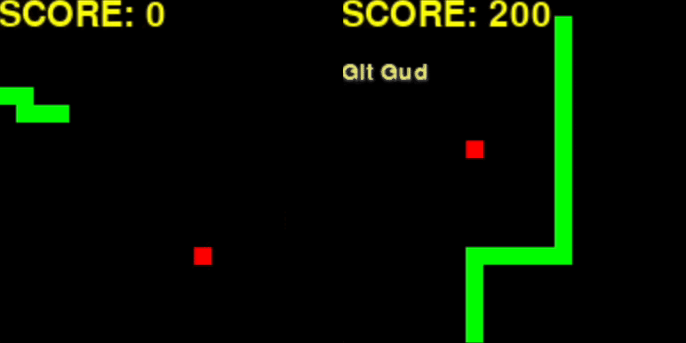

# Snek 🐍: Development of Deep Q-Learning Agent for Playing the Game of Snake

This work presents the implementation of an agent for the game of Snake using Deep Q-Learning. We present the model, state space and reward engineering adopted, as well as the evolution of the agent's performance across training episodes and during evaluation. In this context, the trained agent is consistently capable of scoring at least 10 times per game in 70\% of its games. Lastly, we discuss the results and present conclusions regarding the employed methodology.

## Features

- [x] Game modes: `GridWall` and `GridLoop`
- [x] Random agent (baseline)
- [x] Deep Q-Learning agent w/ experience replay
- [x] Training and testing scripts

<center>

</center>

## Requirements

Setup a virtual environment and install the required packages:

```bash
python -m venv env
source env/bin/activate
pip install --upgrade pip
pip install -r requirements.txt
```

## Usage

For playing the game of Snake, run:

```bash
python main.py
```

For training the agent, run:

```bash
python training.py
```

For testing the agent, run:

```bash
python testing.py
```
